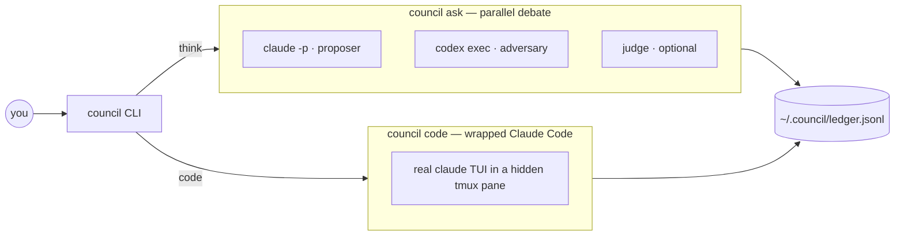

<div align="center">

# council

**Think and code with a cross-family second opinion.**

`council` is a thin harness that wraps the *real* Claude Code binary and can summon an
OpenAI Codex adversary on demand — Claude proposes, Codex critiques, you decide.

[](https://github.com/cmengu/Harness-Scaffolding/actions/workflows/ci.yml)


</div>

```text
$ council ask                     # open the REPL
❯ /duel                           # summon the adversary
❯ how should I shard this table?  # claude answers, codex attacks, both revise
❯ /judge moderator                # add a synthesizing third voice
❯ /rounds 2                       # let the debate run deeper
❯ /report                         # what did all that cost?
```

Every turn — debates and coding sessions alike — lands in one append-only ledger, so any
run can be replayed later with `council show <run-id>`.

## Table of contents

- [Why council?](#why-council)
- [How it works](#how-it-works)
- [Quickstart](#quickstart)
- [Commands](#commands)
- [Think mode: `council ask`](#think-mode-council-ask)
- [Code mode: `council code`](#code-mode-council-code)
- [Shadow mode: A/B your config](#shadow-mode-ab-your-config)
- [Replay and telemetry](#replay-and-telemetry)
- [Configuration](#configuration)
- [Failure semantics](#failure-semantics)
- [Privacy](#privacy)
- [Testing and contributing](#testing-and-contributing)
- [Project layout](#project-layout)
- [FAQ](#faq)
- [Roadmap](#roadmap)
- [Attribution and license](#attribution-and-license)

## Why council?

Ask one model to review its own answer and it mostly agrees with itself. A second head
from a *different* model family, prompted to attack rather than assist, catches the
assumptions the first one can't see. `council` makes that adversarial second opinion a
single keystroke (`/duel`) instead of a copy-paste ritual between two terminals.

Three commitments shape the design:

1. **Wrap, don't reimplement.** Code mode drives the genuine `claude` binary — your
   `~/.claude` hooks, settings, and muscle memory stay live underneath.
2. **Evidence over scraping.** Input delivery is confirmed by a hook receipt written from
   *inside* Claude Code, never by guessing at pixels. If the receipt doesn't arrive,
   council fails loud instead of stalling silent.
3. **One ledger.** Debates, coding turns, costs, retries, and failures all append to a
   single JSONL trail with run IDs — every session is auditable and replayable after the fact.

## How it works



In a duel, round 0 fans both heads out **concurrently** — measured across real duels this
lands ~1.5× faster than serial (equal-length heads approach 2×). Rounds 1–N show each head
the other's answer and demand a critique plus a revised answer; the loop stops early once
both heads move less than ~10% between rounds (no movement = converged). An optional judge
(`moderator` or `reasoning` style) synthesizes at the end. The orchestration is
deterministic Python — no LLM decides the control flow.

## Quickstart

```sh
git clone https://github.com/cmengu/Harness-Scaffolding.git
cd Harness-Scaffolding
pip install -e harness-project
council --help
```

Requirements:

| Requirement | Needed for |
|---|---|
| Python 3.11+ | everything (`tomllib`) |
| `claude` on PATH | code mode, and the default proposer in think mode |
| `codex` on PATH | duels (optional — think mode works solo without it) |
| `tmux` | code mode (the real Claude Code runs in a hidden pane) |

First debate:

```sh
council ask -p "what's the failure mode of this design?" --duel
```

First wrapped coding session:

```sh
council code        # your usual claude, in council's skin, with a ledger underneath
```

## Commands

| Command | What it does |
|---|---|
| `council ask` | **THINK** — chat with Claude; `/duel` makes Codex challenge each answer (`claude -p` vs `codex exec`) |
| `council code` | **CODE** — a branded front over the *real* `claude` binary, hidden in tmux; your `~/.claude` hooks and settings stay live |
| `council attach` | reconnect to a live code session — after a `/detach` or a crashed wrapper — with the conversation repainted |
| `council shadow` | one question under your current config (arm A) and current-plus-overrides (arm B), answers side by side |
| `council report` | runs · cost · latency · failure rates aggregated from the ledger (`--days N`, default 7) |
| `council show <run-id>` | replay any past run — questions, debate columns, verdicts, and what went wrong |

Useful flags: `council ask -p "…"` answers once and exits; `--rounds N`, `--judge
moderator|reasoning`, and `--duel` set the debate posture up front; `council code
--resume` picks up your last coding session.

## Think mode: `council ask`

An interactive REPL with multi-line input, history, and slash-command completion.
Conversations are durable *because* they live in the ledger: you can leave, come back,
resume, branch, and compact — across processes.

| Command | What it does |
|---|---|
| `/duel [on\|off]` | toggle the codex adversary (bare `/duel` flips it) |
| `/rounds N` | debate depth when duelling |
| `/judge <style>` | `off` · `moderator` · `reasoning` |
| `/model [head] [name]` | per-head model override — `/model claude opus`, `/model reset` |
| `/effort [level]` | codex reasoning effort: `minimal` · `low` · `medium` · `high` |
| `/status` | adversary · rounds · judge · heads · session cost |
| `/cost` | what this session has spent so far |
| `/last` | reprint the previous answer / debate |
| `/history` | everything the heads currently remember |
| `/context` | memory size vs the cap (chars · turns · summary) |
| `/compact` | squash memory into a summary and keep going |
| `/switch [#\|id]` | list past conversations · resume one |
| `/fork [title]` | branch this conversation: same memory, new tangent |
| `/new` | fresh memory boundary |
| `/report [days]` | runs · cost · latency · failures from the ledger |
| `/show <run-id>` | replay one run |
| `/help` | all commands |
| `/exit` | leave |

`^C` cancels a turn in flight without killing the REPL. Heads deliberately run
**text-only** in think mode — no tools, no file access; that's what code mode is for.

## Code mode: `council code`

`council code` launches the genuine Claude Code TUI in a hidden tmux pane and drives it
through two verified channels:

- **Inject** — your input is delivered by a bracketed tmux paste. Delivery is confirmed by
  a `UserPromptSubmit` hook receipt written from *inside* Claude Code — not by
  screen-scraping. If no receipt arrives, council re-sends Enter and eventually fails loud.
- **Hooks out** — streamed text, tool calls, and busy/idle state come back through Claude
  Code's hook and statusLine interfaces, rendered in council's skin.

Council's hooks are passed via `--settings` and *stack* with whatever is already
registered in `~/.claude` — your existing setup keeps working underneath.

Three safety layers ride those hooks:

- **Permission relay** — when the hidden claude stops on a permission prompt (its own, or
  one raised by council's blast-radius gate), council shows the prompt text and forwards
  your answer (`1`/`2`/`y`/`esc`) as raw keystrokes. Previously this state was a dead-end
  stall.
- **Budget checkpoints** — set `code_budget_usd` and the PreToolUse gate asks (through
  claude's own permission prompt) each time the session's running cost crosses another
  multiple, stopping a runaway agentic loop at the next tool boundary. Approving a
  checkpoint silences it; the next multiple asks again.
- **Approval memory** — approving a gated command once (evidenced by the tool actually
  running) silences that *exact* command for the rest of the session. Session-scoped by
  construction: the memory file lives in the per-session bridge dir and dies with it.
  Auto-allowed calls are printed (`⚑`) and ledgered, never silent.

`/detach` leaves the hidden claude running and returns your terminal; `council attach`
lists live sessions and reconnects (dead-session litter is pruned as it lists).

## Shadow mode: A/B your config

Changing a knob and *hoping* it helped is not an eval. `council shadow` runs one question
twice — arm A under your current config, arm B under current-plus-overrides — and prints
the answers side by side:

```sh
council shadow -p "review this schema" --set rounds=2 --set judge_style=moderator
```

Arms run sequentially on purpose (small blast radius), land in the ledger as one run, and
stay addressable: `council show <run-id>` replays the comparison later.

## Replay and telemetry

Every invocation gets a short **run ID** that threads through every ledger row it
produces. On exit you're told `run <id> — 'council show <id>' to replay`.

- `council report --days 14` — runs, head calls, failure and retry rates, latency
  (median · p95 · worst), and spend, plus a per-run table of the last 15 runs.
- `council show <run-id>` — full replay of one run: user turns, debate columns, judge
  verdicts, errors, retries, and quarantine pointers.
- In-REPL: `/status`, `/cost`, and `/context` answer the running-session versions of the
  same questions.

Costs are captured per head call in think mode (from `claude -p --output-format json`) and
per session in code mode (from the statusLine's running total).

## Configuration

`~/.council/config.toml` — every key optional, `COUNCIL_*` env vars override the file, and
an unparseable value falls back to its default instead of crashing:

```toml
rounds = 1                  # debate rounds per duel
history_turns = 6           # ask-mode memory: past turns carried into each head call
judge_style = ""            # "" = off · moderator · reasoning
claude_model = ""           # ask-mode model overrides ("" = each CLI's default; /model flips live)
codex_model = ""
codex_effort = ""           # codex reasoning effort: minimal·low·medium·high (/effort)
ask_budget_usd = 0.0        # ask-mode budget; > 0 = red nag in the turn receipt once crossed
code_budget_usd = 0.0       # code-mode budget; > 0 = ask at each crossed multiple (0 = off)
claude_command = "claude"   # which binaries to drive
codex_command = "codex"
head_timeout = 300          # per-head subprocess timeout, s
head_retries = 2            # extra attempts on TRANSIENT head failures (429/quota/connection)
retry_base_delay = 1.0      # backoff between attempts: 1s → 2s → 4s
turn_timeout = 600          # max wait for a code-mode turn
submit_timeout = 10         # max wait for a delivery receipt before failing loud
submit_retry_interval = 1.0 # re-send Enter this often while the receipt is missing
tmux_ready_timeout = 30.0   # boot: tmux target + input box mounted
paste_settle = 0.1          # gap between paste and the submit Enter
draft_watch_timeout = 5.0   # advisory-only pane watch window
boot_probe = false          # spend one turn at launch proving the receipt loop works

# theme — make the skin yours
banner_title = "COUNCIL"
banner_tagline = ""
accent_color = "blue"       # any Rich color name or hex
banner_art = ""             # multi-line ASCII mascot; "" = classic banner

[heads]
proposer = "claude"
adversary = "codex"
# judge = "claude"          # which family judges (style comes from judge_style)
```

## Failure semantics

A head failing must never kill a debate. Transient failures (429 / rate limit / quota /
connection resets / timeouts) are retried with exponential backoff (`head_retries`,
`retry_base_delay`); permanent ones (bad flag, bad auth) fail fast — retrying those is
just failing slowly. A head that stays dead degrades the turn to single-voice and leaves
a **quarantine postmortem** (`~/.council/quarantine/*.md`): what was asked, what the error
said, and whether rerunning is worth it. `council report` shows the failure and retry
rates; `council show <run-id>` replays any run including what went wrong.

## Privacy

`~/.council/ledger.jsonl` stores the **full text of your conversations** (both modes). It
is created owner-only (0600), but treat it like a shell history file: don't commit it,
don't share it casually. Quarantine postmortems carry prompt text too, so they get the
same owner-only treatment.

**No secrets live in this repo** — credentials stay inside the `claude`/`codex` CLIs
themselves; council never sees or stores an API key.

## Testing and contributing

```sh
pip install -e "harness-project[dev]"
cd harness-project && pytest -q
```

The suite (37 tests) runs the entire debate loop against **stub heads**
(`tests/stubs/`) — shell scripts that impersonate `claude -p` and `codex exec`, including
rate-limited, hung, flaky-once, and bad-flag variants. No API keys, no network, no cost;
CI runs the same suite on every push. If you send a change, make the suite pass and add a
stub-backed test for any new failure mode you introduce.

## Project layout

```text
harness-project/
├── council/
│   ├── cli.py         # entry point — ask · code · attach · shadow · report · show
│   ├── chat.py        # think-mode REPL, slash commands, conversation memory
│   ├── debate.py      # fan-out, rounds, early-stop, judge
│   ├── backends.py    # claude -p / codex exec runners + failure classification
│   ├── ledger.py      # append-only JSONL, run IDs, session chains, quarantine
│   ├── report.py      # aggregation + replay
│   ├── shadow.py      # config A/B harness
│   ├── policy.py      # blast-radius gate (ALLOW / ASK / DENY)
│   └── wrap/          # code mode: tmux bridge, hooks, budget gate, renderer
└── tests/             # 37 hermetic tests + stub heads (no keys, no network)
```

## FAQ

**Does code mode replace my Claude Code setup?**
No — it wraps it. The real `claude` binary runs underneath, and council's hooks stack on
top of whatever `~/.claude` already registers.

**What if I don't have `codex`?**
Think mode works solo. `/duel` and shadow arms that need the adversary are the only parts
that require it.

**Why tmux?**
Because the wrapped thing is the genuine Claude Code TUI, not a reimplementation. tmux is
how council keeps it alive, hidden, and injectable — and how `/detach` + `council attach`
survive a crashed wrapper.

**Where does my data go?**
Nowhere. The ledger, quarantine files, and approval memory are local files under
`~/.council/` and the per-session bridge dir. Council adds no network calls of its own.

**Windows?**
Not natively — code mode needs tmux. WSL works.

## Roadmap

- **Delete the advisory scrape.** Pane screen-scraping is already demoted to advisory —
  the hook receipt is the sole delivery oracle. The scrape gets deleted once the
  disagreement log stays empty in real use (empty so far, including live code sessions).
- **`council review`** — cross-family code review as a first-class mode; documented
  future work, deliberately cut from v1.
- **Field notes from live verification (7 Jul 2026):** the `PermissionRequest` relay
  surfaced a real gated `git push`, forwarded the answer, and recorded it; `/exit` and
  `/detach` typed at a relay act on the wrapper, never the hidden menu. First-ever launch
  in a directory: claude drops the first paste during first-visit initialization, so
  delivery detects the vanished draft and re-pastes once (`paste_retry` ledger rows track
  how often this fires).

## Attribution and license

Portions of this code (notably `council/policy.py` and `council/wrap/bridge.py`) are
adapted from [omnigent](https://github.com/omnigent-ai/omnigent) by Databricks, Inc.,
under the Apache License 2.0 — see [`harness-project/NOTICE`](harness-project/NOTICE)
for the full inventory of adapted files. The full omnigent source is not distributed
here.

This repository does not yet declare a top-level license for its own code.
